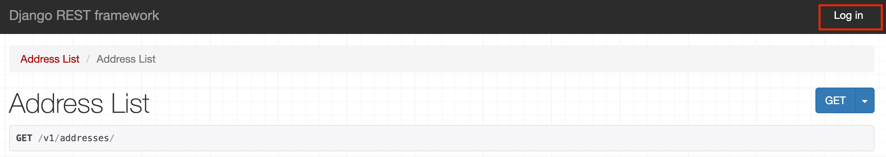
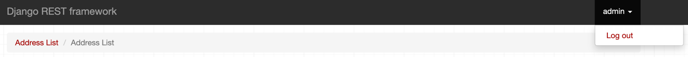

# Address book

## Introduction
This is an implementation of a simple address book application using Python 3.10 + Django Rest Framework. The data is stored in a SQLite3 local instance.

This application allows users to create, retrieve, update and delete entries from an address book. Users can store a contact with its respective address details.

## Installation guide
To start using this application, you need to install the dependencies and run a local server.

 1. Clone this repository
 2. Create a virtual environment to install the dependencies (not mandatory, but recommended). To do this, run this command in the root of the folder where this application was cloned 
```bash
[alice@laptop address_book] python3 -m venv venv
```
 3. Load the virtual environment
```bash
[alice@laptop address_book] source venv/bin/activate 
```
4. Install the depencendcies `requirements.txt`
```bash
(venv) [alice@laptop address_book] pip install -r requirements.txt 
```
5. Run migrations
```bash
(venv) [alice@laptop address_book] python manage.py makemigrations
(venv) [alice@laptop address_book] python manage.py migrate 
```
6. Start the server
```bash
(venv) [alice@laptop address_book] python manage.py runserver 
```
7. Access the application
The application will be ready to use in http://127.0.0.1:8000/v1/addresses/.

## Usage guide
The application has a Browsable API available in http://127.0.0.1:8000/v1/addresses/. 

### Authentication 
Authentication is required to interact with **all** the endpoints.

#### Create a new user
To create a new user, run this command in the root folder of the application:
```bash
(venv) [alice@laptop address_book] python manage.py createsuperuser 
```

#### Login via Browsable API
Users can login using the button `Log In` in the top right of the Browsable API:


#### Logout via Browsable API
After a successfull login, users can logout by clicking on their username on the top right of the screen and then clicking on `Log out`


#### Login via endpoints
1. Users can obtain an authorization token using the POST endpoint http://localhost:8000/v1/auth/login/ with the following payload:
```json
{
	"username": "MyUsername",
	"password": "MyPassword"
}
```
2. This endpoint will generate a token. This token needs to be added to the Authorization header of each call with the prefix `Token`. See an example with Curl
```bash
curl --request GET \
  --url http://localhost:8000/v1/addresses/ \
  --header 'Authorization: Token MyGeneratedToken'
```

#### Logging out via endpoints
Users can logout with a GET request to http://localhost:8000/v1/auth/logout/ 

### Endpoints

#### Create a new entry
Users can create a new entry with a POST request to http://localhost:8000/v1/addresses/

The fields available are:

| Field        | Description                                    | Mandatory? |
|--------------|------------------------------------------------|------------|
| contact_name | Name of the person to add to the address book  | Yes        |
| house_number | Number of the house associated to the contact  | Yes        |
| road         | Road of the house associated to the contact    | Yes        |
| postcode     | Postcode the house associated to the contact   | No         |
| city         | City of the house associated to the contact    | No         |
| state        | State of the house associated to the contact   | No         |
| country      | Country of the house associated to the contact | No         |

Example payload:
```json
{
	"contact_name": "John Doe",
	"house_number": "42",
	"road": "Lake Street",
	"postcode": "ABC123",
	"city": "Los Angeles",
	"state": "California",
	"country": "United States of America"
}
```

#### List all addresses
Users can list the addresses with a GET request to http://localhost:8000/v1/addresses/. Only the contacts created by the authenticated user will be returned.

**Filtering**: All the fields from the payload to create a contact can be used as query parameters to filter the results. Note that all the fields are case insensitive.

The following example filters by contact name containing `john` and the state `california`:
```bash
curl --request GET \
  --url 'http://localhost:8000/v1/addresses/?contact_name=john&state=california' \
  --header 'Authorization: Token MyToken'
 ```

**Pagination**: The following query parameters can be used for pagination:
- `page_size`: Number of addresses returned per request
- `page`: Number of the current page to be returned


#### Update an address
An address can be updated with a PATCH request to http://localhost:8000/v1/addresses/{ID_TO_BE_UPDATED}/. Any field from the payload to create a contact can be updated.


#### Delete an address
An address can be deleted with a DELETE request to http://localhost:8000/v1/addresses/{ID_TO_BE_DELETED}/

#### Delete multiple address
Multiple addresses can be deleted with a DELETE request http://localhost:8000/v1/addresses/ using the parameter `id__in`. The ids to be deleted should be comma separated. Example:
```bash
curl --request DELETE \
  --url 'http://localhost:8000/v1/addresses/?id__in=9%2C13' \
  --header 'Authorization: Token MyGeneratedToken'
  ```

## Next Steps
This application can evolve in a number of ways. Here I list some of the features (functional or non-functional) that could be added in the feature:

1. **Prevent the addition of duplicated addresses:**
I opted to not implement this feature because I would need more clarification on what is a duplicated address. I assume the same contact can have multiple addresses (e.g. home address, work address, address abroad etc.). Also, multiple people can be connected to the same address (think of a work address of a large company. Multiple contacts can be associated to this same address). To implement the right feature, I would prefer to experiment with the users and understand what works better for them. 
2. **Validation of addresses:** Users can add addresses from _any_ part of the world. This makes it hard to validate all the addresses to avoid misspellings and usage of different names to represent the same place (e.g. US, USA, United States of America) 
3. **Ordering:** Currently the results are always ordered by the contact name. In a next iteration users could be able to sort it using different criteria.
